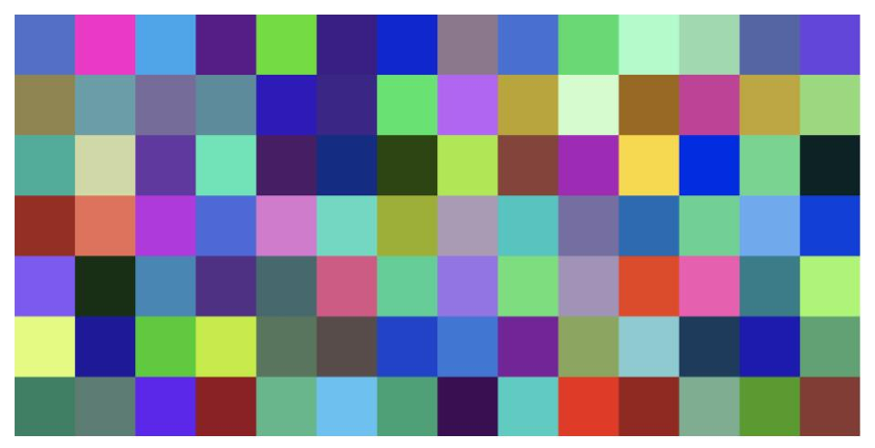

# **Color Boxes**

## Description
This was an exercise from the Udemy course, "The Modern React Bootcamp" by Colt Steele.  This exercise was for educational purposes and was used to practice React props, state, and simple click events.  Clicking any box generates a random color.

## Screenshot
